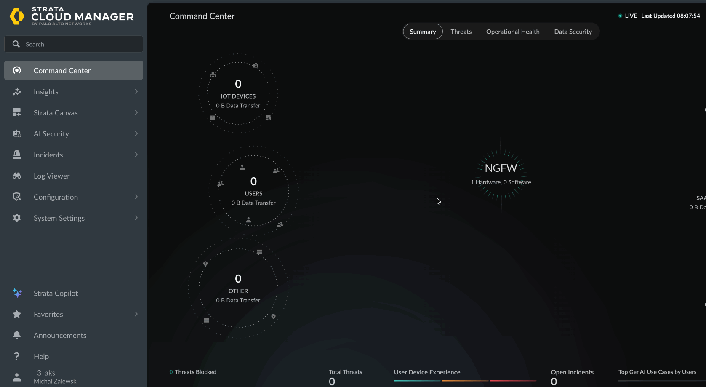

# Deployment Guide – Prisma AIRS on GCP
## Network Intercept + API Runtime Intercept

> **Version:** 3.0 | **Updated:** April 2026
> Repository: https://github.com/mzalewski87/GCP-AI-WEBINAR-EN

---

## Table of contents

1. [Solution architecture](#1-solution-architecture)
2. [Prerequisites](#2-prerequisites)
3. [PHASE 1 – Application infrastructure (Terraform)](#3-phase-1--application-infrastructure-terraform)
4. [PHASE 2 – Deploying the AI applications](#4-phase-2--deploying-the-ai-applications)
5. [PHASE 3 – Generating network traffic](#5-phase-3--generating-network-traffic)
6. [PHASE 4 – Onboarding the GCP account in SCM](#6-phase-4--onboarding-the-gcp-account-in-scm)
7. [PHASE 5 – AIRS Network Intercept (SCM Deployment)](#7-phase-5--airs-network-intercept-scm-deployment)
8. [PHASE 6 – SCM configuration after firewall deployment](#8-phase-6--scm-configuration-after-firewall-deployment)
9. [PHASE 7 – Kubernetes Container Security (Helm)](#9-phase-7--kubernetes-container-security-helm)
10. [PHASE 8 – AIRS API Runtime Intercept](#10-phase-8--airs-api-runtime-intercept)
11. [Verification and webinar demo](#11-verification-and-webinar-demo)
12. [Troubleshooting](#12-troubleshooting)
13. [Appendix – Reference tables](#13-appendix--reference-tables)

---

## 1. Solution architecture

```
┌─────────────────────────────────────────────────────────────────────┐
│  MODE 1: Network Intercept (Prisma AIRS AI Runtime Firewall)        │
│                                                                     │
│  User                                                               │
│     │                                                               │
│     ▼ (ELB)                                                         │
│  AIRS Firewall ◄──── Deployed by SCM-generated Terraform            │
│  nic1 (untrust) │ inspects prompts → blocks threats                 │
│  nic2 (trust)   │                                                   │
│     │           │                                                   │
│     ▼ (ILB)     │                                                   │
│  GKE Chatbot ───┘                                                   │
│     │                                                               │
│     ▼                                                               │
│  Gemini AI API ◄── response inspection                              │
│                                                                     │
├─────────────────────────────────────────────────────────────────────┤
│  MODE 2: API Runtime Intercept (AIRS SDK)                           │
│                                                                     │
│  User → GKE API Chatbot                                             │
│                    │                                                │
│                    ├─► AIRS SDK scan (prompt)  ────► SCP API        │
│                    │     ALLOW / BLOCK                              │
│                    │                                                │
│                    ├─► Gemini AI                                    │
│                    │                                                │
│                    └─► AIRS SDK scan (response) ───► SCP API        │
│                          ALLOW / BLOCK                              │
└─────────────────────────────────────────────────────────────────────┘
```

### Two demo applications

| Application | Namespace | Protection mode | Port |
|-----------|-----------|-------------|------|
| `ai-chatbot` | `ai-chatbot` | Network Intercept (AIRS Firewall) | 80 |
| `api-chatbot` | `ai-api-chatbot` | API Runtime Intercept (SDK) | 80 |

---

## 2. Prerequisites

### Local tools

| Tool | Min version | Install |
|-----------|-------------|------------|
| Terraform | >= 1.3, < 2.0 | `brew install terraform` |
| gcloud CLI | >= 470 | https://cloud.google.com/sdk/docs/install |
| kubectl | >= 1.28 | `brew install kubectl` |
| Helm | >= 3.0 | `brew install helm` |
| git | >= 2.40 | `brew install git` |
| jq | >= 1.7 | `brew install jq` |

> **Docker is NOT required** – images are built by Google Cloud Build.

### Palo Alto Networks accounts and licenses

- **Palo Alto Networks Customer Support Portal** – for activating NGFW credits and creating a Deployment Profile
- **Strata Cloud Manager (SCM)** – for onboarding and deployment
- **Software NGFW Credits** – for licensing the AIRS firewall
- **Strata Logging Service** – active (required for onboarding)
- The **AI Runtime Security** module activated in the tenant

### Licensing (BYOL)

Before deployment, in the Customer Support Portal:
1. **Activate Software NGFW Credits** (Products → Software/Cloud NGFW Credits)
2. **Create a Deployment Profile** for AI Runtime Security (Instance)
3. **⚠️ CRITICAL: Associate the Deployment Profile with the correct TSG (Tenant Service Group)**

> **🔴 WITHOUT THIS THE FIREWALLS WILL NOT REGISTER WITH SCM!**
>
> The Deployment Profile **MUST** be associated with the same TSG (Tenant Service Group)
> on which your Strata Cloud Manager runs. If you don't do this:
> - The firewalls will boot and activate the license
> - But they will **NOT connect to SCM** — because SCM does not know about their profile
> - In CSP you will see status **"Finish Setup"** instead of "Active"
>
> **How to do it:**
> 1. CSP → Products → Software/Cloud NGFW Credits → find the Deployment Profile
> 2. Click **"Finish Setup"** or **"Associate TSG"**
> 3. Pick **the TSG on which your SCM tenant runs** (usually the main TSG)
> 4. Confirm — the status will change to **"Active"**
>
> **How to check which TSG is the correct one:**
> - SCM → Settings → Tenant Info → note the TSG name
> - CSP → Tenant Service Groups → find the same TSG
> - The Deployment Profile must be associated with THIS TSG
>
> If in CSP you see "Finish Setup" next to your Deployment Profile — **STOP**
> and fix it BEFORE you move on to generating the PIN and the Terraform template.

4. **Generate a Device Certificate** (Registration PIN) – Products → Device Certificates → Generate Registration PIN
5. **Save the Auth Code, PIN ID and PIN Value** – needed in PHASE 5

Details: https://docs.paloaltonetworks.com/ai-runtime-security/activation-and-onboarding

### GCP requirements

- A GCP project with the `Owner` or `Editor` role
- A billing account linked to the project

---

## 3. PHASE 1 – Application infrastructure (Terraform)

### 3.1 Clone the repository

```bash
git clone https://github.com/mzalewski87/GCP-AI-WEBINAR-EN.git
cd GCP-AI-WEBINAR-EN
```

### 3.2 Authenticate gcloud

```bash
gcloud auth application-default login
gcloud config set project YOUR_PROJECT_ID
export PROJECT_ID=$(gcloud config get-value project)
```

### 3.3 Configure variables

```bash
cp terraform.tfvars.example terraform.tfvars
# Edit terraform.tfvars – fill in project_id, region, zone
```

### 3.4 Deploy infrastructure

```bash
terraform init
terraform plan -out=tfplan
terraform apply tfplan    # ~15-25 minutes
```

**What gets deployed automatically:**

| Component | Description |
|-----------|------|
| **1 VPC** | **airs-app-vpc** (Application VPC – GKE + AI apps) |
| Subnet | airs-app-subnet with VPC Flow Logs (5s, 100% sampling, metadata) |
| Cloud NAT | App VPC (GKE → internet) |
| GKE Cluster | airs-ai-cluster in App VPC with Workload Identity |
| Artifact Registry | Container repository |
| GCS Bucket | For AIRS logs + SCM discovery |
| Service Accounts | GKE Node SA, AI App SA |
| Workload Identity | KSA↔GSA bindings |
| Secret Manager | AIRS API Key secret |
| **SCM Prerequisites** | **Configured automatically:** |
| - Data Access Audit Logs | Vertex AI API → Data Read |
| - Log Router Sink | VPC flows + AI audit → GCS bucket |
| - Cloud Asset API | Enabled automatically |
| - Generative Language API | For Gemini AI |

> ⚠️ **IMPORTANT:** Our Terraform creates ONLY **1 VPC** (`airs-app-vpc`).
> The firewall VPCs (mgmt, untrust, trust), VM-Series SA, Tag Collector SA
> and the entire firewall infrastructure are created by **SCM-generated Terraform** (PHASE 5).
> SCM peers its Trust VPC with our App VPC.

### 3.5 Save the outputs

```bash
terraform output scm_deployment_inputs
./scripts/get-outputs.sh
```

> **Keep these values — they are needed in PHASE 4 and 5.**

---

## 4. PHASE 2 – Deploying the AI applications

```bash
chmod +x scripts/deploy-app.sh
./scripts/deploy-app.sh
```

The script builds and deploys:
- `ai-chatbot` → Network Intercept demo
- `api-chatbot` → API Runtime Intercept demo

**The script automatically annotates the `ai-chatbot` namespace:**
- `paloaltonetworks.com/firewall=pan-fw` – pan-cni hooks the pods (CNI chaining)
- `paloaltonetworks.com/subnetfirewall=kube-system/bypass-metadata` – traffic to
  `169.254.169.254` (GCP metadata) **bypasses the firewall**. Without this Workload Identity
  cannot fetch a token → the app cannot call the Gemini API.

> 💡 The SubnetInfo CRD `bypass-metadata` is created by the community helm chart in PHASE 7.
> The annotation written NOW only takes effect AFTER pan-cni is installed – there is no harm in
> setting it earlier (it is idempotent, you can also re-run it):
> ```bash
> kubectl annotate namespace ai-chatbot \
>   paloaltonetworks.com/subnetfirewall=kube-system/bypass-metadata --overwrite
> ```

### Accessing the applications

Both applications are reachable on **public IP addresses** (LoadBalancer) restricted to the CIDRs from `allowed_mgmt_cidrs` in `terraform.tfvars`.

The `deploy-app.sh` script automatically:
- Reads `allowed_mgmt_cidrs` from `terraform.tfvars`
- Sets `loadBalancerSourceRanges` on both Kubernetes services
- Prints the public IPs at the end of the deployment

```
🌐 Public IP addresses (restricted to: ["203.0.113.x/32"]):
   Network Intercept: http://34.x.x.x
   API Runtime:       http://34.y.y.y
```

> **Important:** Set `allowed_mgmt_cidrs` to your public IP in `terraform.tfvars` BEFORE running `deploy-app.sh`:
> ```hcl
> allowed_mgmt_cidrs = ["203.0.113.x/32"]   # ← Your public IP
> ```

### Alternative access: kubectl port-forward

If you don't have access from a public IP (e.g. behind NAT), use port-forward:

```bash
# Network Intercept chatbot → http://localhost:8080
kubectl port-forward svc/ai-chatbot 8080:80 -n ai-chatbot

# API Runtime chatbot → http://localhost:8081
kubectl port-forward svc/api-chatbot 8081:80 -n ai-api-chatbot
```

---

## 5. PHASE 3 – Generating network traffic

```bash
./scripts/generate-traffic.sh
```

> **Critical:** SCM uses logs for discovery. Wait ~60 minutes after generating traffic before onboarding (the logs need time to show up in the bucket).

---

## 6. PHASE 4 – Onboarding the GCP account in SCM

> **Source:** https://docs.paloaltonetworks.com/ai-runtime-security/activation-and-onboarding/onboard-and-activate-cloud-account-in-scm/gcp-onboarding-prereq-and-steps

### 6.1 Prerequisites (automatically met by Terraform)

Our `terraform apply` (PHASE 1) automatically configures:
- ✅ VPC Flow Logs (5s, 100% sampling, metadata)
- ✅ Data Access Audit Logs (Vertex AI API → Data Read)
- ✅ GCS Bucket for logs
- ✅ Log Router Sink (VPC flows + AI audit → bucket)
- ✅ Cloud Asset API enabled

**The only manual step:**
```bash
# Create the GCP Service Identity (required to deploy TF from SCM)
gcloud beta services identity create \
  --service=cloudasset.googleapis.com \
  --project=$PROJECT_ID
```

### 6.2 Onboarding in SCM

1. Log in to **Strata Cloud Manager**
2. Navigate: **AI Security → AI Runtime → AI Runtime Firewall**
3. Click the **Cloud Account Manager** icon (cloud) → **Add Cloud Account**
4. Select **GCP** → **Next**
5. Provide:
   - **Name:** unique name (max 32 characters), e.g. `airs-webinar-gcp`
   - **GCP Project ID:** copy from: `terraform output project_id`
6. In **Permissions** section select **"Discovery"**.
7. Click **Next**. Configure **Application Definition**:
   - For Container Workloads: **Namespace** (default)
   - For VMs: **VPC/VNET** (default)
   - For section **Are the cluster workloads private?** select **No**.
   - **Storage bucket for logs:** ⚠️ **COPY the exact value** from: `terraform output scm_onboarding_bucket_name`
     > **NOTE:** Do NOT type it manually! A typo (e.g. a double dash) will cause a `bucket does not exist` error in SCM Terraform.
8. Click **Next**
9. Provide a **Service Account Name** (3-24 characters, lowercase letters and digits)
10. **Download Terraform** — SCM generates its own Terraform for onboarding

11. **Apply the downloaded Terraform:**
    ```bash
    cd <downloaded-folder>/gcp
    terraform init
    terraform plan
    terraform apply
    ```
    Output: `service_account_email = "panw-discovery-****@PROJECT_ID.iam.gserviceaccount.com"`
12. Click **Done** in SCM

> Discovery takes ~15 minutes. Assets will appear on the SCM dashboard.

---

## 7. PHASE 5 – AIRS Network Intercept (SCM Deployment)

> **Source:** https://docs.paloaltonetworks.com/ai-runtime-security/administration/deploy-ai-instances-in-public-clouds-as-a-software/add-ai-instance-for-gcp

### 7.1 Add protection in SCM

1. **AI Security → AI Runtime → AI Runtime Firewall**
2. Click **Add Protections (+)**
3. Select **Cloud Service Provider** → **Next**

### 7.2 Firewall Placement

Pick the traffic types to inspect:
- ✅ AI Traffic (traffic between applications and AI models)
- ✅ Non-AI and non-cluster traffic

### 7.3 Region & Applications

- Pick the **cloud account** (onboarded in PHASE 4)
- Pick the **region** (e.g. us-central1)
- Pick the **applications** to protect (discovered automatically)
- Set **Public IP** on the ELB: Auto generate or Input manually

### 7.4 Protection Settings

```
Deployment parameters:
  Firewall type:    AI runtime security (or VM-Series)
  Service account:  SCM creates the SA automatically – type any name
                    (e.g. "gcpsservice" – SCM will add a prefix and create the SA in its TF)
  Number of firewalls: 2
  Zones:            us-central1-c (or another)
  Instance type:    n2-standard-4 (minimum 4 vCPU)

IP addressing:
  SCM creates ITS OWN VPCs with these CIDRs (must be DIFFERENT than app VPC 10.0.2.0/24!):
  Untrust VPC CIDR:     e.g. 10.1.1.0/24
  Trust VPC CIDR:       e.g. 10.1.2.0/24
  Management VPC CIDR:  e.g. 10.1.0.0/24

Licensing:
  ⚠️ CHECK FIRST: the Deployment Profile must be associated with the correct TSG!
  If in CSP you see "Finish Setup" → fix it BEFORE you fill in the values below.
  (see section 2: Licensing → item 3)

  PAN-OS version:       11.2.x (latest available)
  Auth Code:            <from Customer Support Portal>
  Device Certificate PIN ID:    <from CSP>
  Device Certificate PIN Value: <from CSP>

Management:
  Allowed CIDR:         0.0.0.0/0 (or your IP)
  SSH Key:              <your public key>
  Manage by:            SCM
  SCM Folder:           <pick a folder>
```

### 7.5 Generate and Apply Terraform

1. Provide a **unique template name** (max 19 characters, lowercase/digits/hyphens)
2. Click **Create Terraform Template**
3. **Save and Download Terraform Template**
4. Unpack and deploy:

```bash
tar -xvzf <downloaded-file.tar.gz>
cd <unpacked-folder>

# ⚠️ CRITICAL STEP: Patch SCM Terraform BEFORE apply!
# SCM does not generate Cloud NAT or egress rules on the mgmt VPC.
# Without this the firewall will NOT retrieve a Device Certificate and will NOT register with SCM!
cd /path/to/GCP-AI-WEBINAR-EN
chmod +x scripts/patch-scm-terraform.sh
./scripts/patch-scm-terraform.sh <unpacked-folder>/architecture/security_project

# Step 1: Deploy the security infrastructure (with the patch!)
cd <unpacked-folder>/architecture/security_project
terraform init
terraform plan    # Check that the patch (airs_mgmt_nat_patch.tf) is visible
terraform apply

# Save the outputs! (external and internal IPs)

# Step 2: Deploy VPC peering (connects the app VPC with the security VPC)
cd ../application_project
terraform init
terraform plan
terraform apply
```

> ⚠️ **CRITICAL:** If you skip the patch step, the firewall will boot, activate the license,
> but will NOT register with SCM — because:
> 1. No Cloud NAT on the mgmt VPC → no internet access from the management interface
> 2. No egress firewall rules → traffic to OCSP/CRL/API is blocked
> 3. The firewall cannot retrieve a Device Certificate → it cannot authenticate to SCM
>
> **Diagnostics:** `gcloud compute instances get-serial-port-output <vm-name> --zone=<zone>`
> Look for: `Failed to retrieve device certificate`

> ⚠️ **PIN EXPIRATION:** The Registration PIN (Device Certificate) has an expiration date.
> If the PIN expired between generating the Terraform and `terraform apply`,
> generate a new PIN in CSP: Products → Device Certificates → Generate Registration PIN.
> Then update `terraform.tfvars` in the `security_project` directory and re-run `terraform apply`.

### 7.6 Verification

After deployment the firewall will appear in SCM:
- **Workflows → NGFW Setup → Device Management → Cloud Managed Devices**
- Wait for status **Connected** (typically 5-15 min from `terraform apply` security_project)

### 7.6.1 🔴 CRITICAL: Update Content on the firewalls BEFORE the first Push Config

> **WITHOUT THIS Push Config will fail with a URL filtering validation error!**

A fresh firewall with a PAN-OS image (e.g. `ai-runtime-security-byol-11211`) has an **old URL/threat content** (typically `app_version: 8902-9003` instead of the current `9093-10005+`). The predefined profile `Internet-Access-Default` in PAN-OS references new URL categories (e.g. `remote-access`) that don't exist in the old database → **commit fail**:

```
Validation Error: profiles -> url-filtering -> Internet-Access-Default
                  -> alert 'remote-access' is not a valid reference
```

**Fix (per firewall, ~5 min):**

```bash
# 1. Get the firewall mgmt IP (after reset/rebootstrap it can change)
MGMT_IP=$(gcloud compute instances describe <fw-name> \
  --zone=<zone> --project=$PROJECT_ID \
  --format="value(networkInterfaces[1].accessConfigs[0].natIP)")

# 2. Download the latest content
echo -e "set cli pager off\nrequest content upgrade download latest\nexit" \
  | ssh -i ~/.ssh/<your-key> -o StrictHostKeyChecking=no admin@$MGMT_IP

# 3. Wait 2-3 min, then install
echo -e "set cli pager off\nrequest content upgrade install version latest\nexit" \
  | ssh -i ~/.ssh/<your-key> -o StrictHostKeyChecking=no admin@$MGMT_IP

# 4. Verify (should be the latest, e.g. 9093-10005)
echo -e "set cli pager off\nshow system info | match version\nexit" \
  | ssh -i ~/.ssh/<your-key> -o StrictHostKeyChecking=no admin@$MGMT_IP
```

> Also applies to the Tag Collector VM. The `scripts/diagnose-airs.sh` script reports `app_version` per device.

### 7.7 ⚠️ CRITICAL: Fix routing in App VPC (after application_project apply)

> **WITHOUT THIS STEP application traffic BYPASSES the firewall and goes straight to the internet!**

SCM-generated Terraform creates the route `*-fw-bypass-route-*` with priority **500** (highest),
which routes all traffic from App VPC to `default-internet-gateway` — bypassing the firewall.
The peering route (through the firewall) has priority 900. In GCP, lower number = higher priority,
so the bypass route wins and traffic NEVER reaches VM-Series.

**Diagnostics:**
```bash
# Check the routes in App VPC — you should see 3 routes for 0.0.0.0/0:
gcloud compute routes list --project=$PROJECT_ID \
  --filter="network:airs-app-vpc AND destRange=0.0.0.0/0" \
  --format="table(name,destRange,nextHopGateway,nextHopPeering,priority)" \
  --sort-by=priority

# Typical result BEFORE the fix:
# bypass-route-0     0.0.0.0/0  default-internet-gateway  —         500  ← WINS!
# peering-route-*    0.0.0.0/0  —                         peering   900  ← loses
# default-route-*    0.0.0.0/0  default-internet-gateway  —         1000
```

**Fix — delete the bypass route and the standard default route:**
```bash
# 1. Find the route names:
BYPASS_ROUTE=$(gcloud compute routes list --project=$PROJECT_ID \
  --filter="network:airs-app-vpc AND name ~ 'bypass'" \
  --format="value(name)")

DEFAULT_ROUTE=$(gcloud compute routes list --project=$PROJECT_ID \
  --filter="network:airs-app-vpc AND destRange=0.0.0.0/0 AND name ~ 'default-route'" \
  --format="value(name)")

# 2. Delete both (only the peering route will remain → traffic flows through the firewall):
gcloud compute routes delete "$BYPASS_ROUTE" --project=$PROJECT_ID --quiet
gcloud compute routes delete "$DEFAULT_ROUTE" --project=$PROJECT_ID --quiet

# 3. Verification — only the peering route should remain:
gcloud compute routes list --project=$PROJECT_ID \
  --filter="network:airs-app-vpc AND destRange=0.0.0.0/0" \
  --format="table(name,destRange,nextHopPeering,priority)"

# Expected result:
# peering-route-*    0.0.0.0/0   airs-app-vpc-*-fw-trust-vpc   900
```

> 💡 **Why this works:** After removing the bypass and default route, the only route 0.0.0.0/0
> is the peering route (priority 900) → all egress traffic from GKE pods goes to Trust VPC
> → ILB → VM-Series firewall → inspection → internet.
>
> This is consistent with the reference PAN tutorial (Task 5, Step 1):
> *"Delete the local default-route within the workload VPCs."*

---

## 8. PHASE 6 – SCM configuration after firewall deployment

> **Source:** https://docs.paloaltonetworks.com/ai-runtime-security/administration/deploy-ai-instances-in-public-clouds-as-a-software

After deploying the Terraform (PHASE 5) the firewall will appear in SCM as **Connected**.
Now you need to configure interfaces, routing, NAT and security policy in SCM.

> ⚠️ **Perform all the configuration below in SCM in the folder
> you picked while creating the template (e.g. `gcp-airs`):**
> Manage → Configuration → NGFW and Prisma Access → Configuration Scope → **pick the folder**

### 8.1 Create Security Zones

Navigate: **Device Settings → Zones → Add Zone**

Create 3 zones:

| Zone name | Type | Purpose |
|---|---|---|
| `untrust` | Layer3 | The untrust interface (eth1/1) — traffic from the internet |
| `trust` | Layer3 | The trust interface (eth1/2) — traffic to/from workload VPCs |
| `health-checks` | Layer3 | Load Balancer loopbacks — receiving GCP health checks |

### 8.2 Configure Dataplane interfaces

Navigate: **Device Settings → Interfaces → Add Interface**

**Untrust interface (eth1/1):**

| Parameter | Value |
|---|---|
| Slot | `ethernet1/1` |
| Interface Type | Layer3 |
| IP Type | DHCP Client |
| Security Zone | `untrust` |
| ✅ Automatically create default route | **CHECKED** |

**Trust interface (eth1/2):**

| Parameter | Value |
|---|---|
| Slot | `ethernet1/2` |
| Interface Type | Layer3 |
| IP Type | DHCP Client |
| Security Zone | `trust` |
| ⚠️ Automatically create default route | **UNCHECKED** |

> ⚠️ **CRITICAL:** On the `trust (eth1/2)` interface **UNCHECK** `Automatically create default route`.
> Trust must not create a default DHCP route — the default traffic exits via untrust.
> If you check it, the traffic will be routed incorrectly!

> 💡 **How to find the interface gateway IP (needed for static routes):**
> In SCM switch context to a specific firewall (Device Management → click on a firewall),
> then: Device Settings → Interfaces → click on the interface → **DHCP Runtime Info**.
> You will see the assigned IP and the gateway address — note the eth1/2 (trust) gateway, you'll need it in 8.5.

### 8.3 Create Loopback interfaces

The loopbacks receive health checks from the GCP Load Balancers. Without them the LB will not consider the firewall healthy.

Navigate: **Device Settings → Interfaces → Loopback → Add Loopback**

**Loopback 1 — External Load Balancer:**

| Parameter | Value |
|---|---|
| Name | `elb-loopback` |
| IPv4 Address | IP from the `lbs_external_ips` output (e.g. `34.75.178.25/32`) |
| Security Zone | `health-checks` |
| Advanced Settings → Management Profile | `allow-health-checks` (create in step 8.4) |

**Loopback 2 — Internal Load Balancer:**

| Parameter | Value |
|---|---|
| Name | `ilb-loopback` |
| IPv4 Address | IP from the `lbs_internal_ips` output (e.g. `10.0.2.253/32`) |
| Security Zone | `health-checks` |
| Advanced Settings → Management Profile | `allow-health-checks` |

> 💡 **How to recover the Load Balancer IPs** (if you lost the security_project TF outputs):
> ```bash
> gcloud compute forwarding-rules list \
>     --filter="name ~ 'airs'" \
>     --format="table(name,IPAddress,loadBalancingScheme)"
> ```

### 8.4 Create the Management Profile

Navigate: while creating the loopback → Advanced Settings → Management Profile → **Create New**

Or: **Device Settings → Interfaces → Interface Management → Add Profile**

| Parameter | Value |
|---|---|
| Name | `allow-health-checks` |
| HTTP | ✅ Enabled |
| HTTPS | ✅ Enabled |

> ⚠️ **Without the Management Profile the Load Balancer health checks will fail!**
> GCP LB sends an HTTP health check to the loopback IP — the firewall has to respond to it.
> Assign this profile to **both** loopbacks (elb-loopback and ilb-loopback).

### 8.5 Create the Logical Router (LR)

Navigate: **Device Settings → Routing → Add Router**

| Parameter | Value |
|---|---|
| Name | `airs-lr` |
| Interfaces | `ethernet1/1`, `ethernet1/2`, `elb-loopback`, `ilb-loopback` |
| ECMP | Optional (useful with multiple ILBs) |

**IPv4 Static Routes** (click Edit → Add Static Route):

| Destination | Next Hop | Interface | Purpose |
|---|---|---|---|
| `10.0.0.0/8` | Gateway from DHCP eth1/2 | `ethernet1/2` | Traffic to workload VPCs (via trust) |
| `35.191.0.0/16` | Gateway from DHCP eth1/2 | `ethernet1/2` | GCP Health Check range 1 |
| `130.211.0.0/22` | Gateway from DHCP eth1/2 | `ethernet1/2` | GCP Health Check range 2 |

> 💡 **Next Hop = the gateway IP from the DHCP runtime info of the eth1/2 (trust) interface.**
> Check it in: Device Management → [firewall] → Interfaces → eth1/2 → DHCP Runtime Info.
>
> The route `10.0.0.0/8` covers our App VPC (10.0.2.0/24), GKE pods (10.100.0.0/16)
> and GKE services (10.200.0.0/20) — so a single route is enough.

### 8.6 PAN-OS Variables (Address Objects per-firewall)

> 💡 PAN-OS Variables let you use symbolic names (`$ELB`, `$GKENODEIP`) in
> NAT/Security rules instead of typing IPs. When the IP changes you only need to
> change the variable's value, not every rule. Also useful in multi-firewall setups.

Navigate: **Manage → Configuration → Setup → Variables → Add** (folder `gcp-airs`)

Create the following variables (type: `ip-netmask`):

| Name | Value | Description |
|---|---|---|
| `$ELB` | `<UNTRUST_ELB_IP>/32` | Public IP of the firewall untrust ELB (e.g. `203.0.113.5/32`) |
| `$ILB` | `<TRUST_ILB_IP>/32` | Trust ILB IP for pan-cni VXLAN (e.g. `10.1.2.253/32`) |
| `$GKENODEIP` | `<GKE_NODE_IP>/32` | A chosen GKE node IP for DNAT target (e.g. `10.0.2.6/32`) |
| `$CL_POD` | `10.100.0.0/16` | GKE Pod CIDR |
| `$CL_SVC` | `10.200.0.0/20` | GKE Service CIDR |

Fetch the values:
```bash
PROJECT_ID=$(terraform output -raw project_id)

# UNTRUST_ELB_IP – the firewall's public ELB (L3_DEFAULT):
gcloud compute forwarding-rules list --project=$PROJECT_ID \
  --filter="region:us-central1 AND IPProtocol=L3_DEFAULT" --format="value(IPAddress)"

# TRUST_ILB_IP – the internal ILB (UDP) for pan-cni:
gcloud compute forwarding-rules list --project=$PROJECT_ID \
  --filter="region:us-central1 AND IPProtocol=UDP" --format="value(IPAddress)"

# GKE_NODE_IP – any node IP (for DNAT target):
kubectl get nodes -o jsonpath='{.items[0].status.addresses[?(@.type=="InternalIP")].address}'
```

Also create **Address Objects** referencing the variables (folder `gcp-airs`):

| Name | Type | Value |
|---|---|---|
| `GKE Node IP` | IP Netmask | `$GKENODEIP` |
| `gogl-hc-elb-net` | IP Netmask | `209.85.0.0/16` (Google ELB health-check) |

### 8.7 NAT Policies

Navigate: **Network Policies → NAT → Add Rule**

#### 8.7a Outbound NAT (pods → internet)

| Parameter | Value |
|---|---|
| Name | `PODs2Internet` |
| Position | Pre-Rule |
| **Original Packet** | |
| Source Zone | `k8s-cluster-1` |
| Destination Zone | `untrust` |
| Source Address | Any |
| Destination Address | Any |
| Service | any |
| **Translated Packet** | |
| Source Translation | Dynamic IP and Port |
| Address Type | Interface Address |
| Interface | `ethernet1/1` (untrust nic0) |

#### 8.7b Inbound DNAT (user → ELB → pod via NodePort)

| Parameter | Value |
|---|---|
| Name | `inbound-dnat-web` |
| Position | Pre-Rule |
| **Original Packet** | |
| Source Zone | `untrust` |
| Destination Zone | `untrust` (before NAT, packet has dst=ELB IP) |
| Source Address | Any |
| Destination Address | `$ELB` |
| Service | `service-http` (TCP/80) |
| **Translated Packet** | |
| Destination Translation | Static IP |
| Translated Address | `GKE Node IP` (address object) |
| Translated Port | `<NODEPORT_AI_CHATBOT>` (e.g. `32639`) |
| Source Translation | Dynamic IP and Port |
| Address Type | Interface Address |
| Interface | `ethernet1/2` (trust nic2) |

> 💡 **You will find the NodePort:** `kubectl get svc -n ai-chatbot ai-chatbot -o jsonpath='{.spec.ports[0].nodePort}'`
>
> **Why source NAT to trust nic2?** The response packet from the pod to the firewall must hit an existing session – if source = real client IP, the return path could go an asymmetric way (through VXLAN-encap). Source NAT to the trust IP guarantees the firewall receives the return packet and matches the session.

#### 8.7c Inbound health-check NAT (Google ELB HC → firewall web GUI)

| Parameter | Value |
|---|---|
| Name | `inbound-healt-check-elb` |
| Position | Pre-Rule |
| **Original Packet** | |
| Source Zone | `untrust` |
| Destination Zone | `untrust` |
| Source Address | `gogl-hc-elb-net` (address object) |
| Destination Address | `$ELB` |
| Service | `health-check-80` (custom – TCP/80, description for Google HC) |
| **Translated Packet** | |
| Destination Translation | Static IP → loopback in the health-check zone (e.g. `127.0.0.1` or a dedicated one) |

> 💡 SCM-generated TF also creates the service objects `health-check-80` (TCP/80) and `health-check-443` (TCP/443) – check in **Objects → Services**.

### 8.8 Security Policies

Navigate: **Security Services → Security Policy → Add Rule → Pre Rules**

#### 8.8a Allow inbound web (user → pod)

| Parameter | Value |
|---|---|
| Name | `allow-inbound-web` |
| Source Zone | `untrust` |
| Source Address | Any |
| Destination Zone | `trust`, `k8s-cluster-1` |
| Destination Address | Any (after DNAT dst=node IP in trust) |
| Application | `web-browsing` |
| Service | `application-default` |
| Action | **Allow** |
| Profile Setting | `best-practice` (or your own AIRS profile group) |
| Log Setting | Cortex Data Lake |

#### 8.8b Allow ELB health-checks

| Parameter | Value |
|---|---|
| Name | `allow-health-checks-http` |
| Source Zone | Any |
| Source Address | `130.211.0.0/22, 35.191.0.0/16, 209.85.152.0/22, 209.85.204.0/22` (Google HC ranges) |
| Destination Zone | `untrust`, `trust`, `health-checks` |
| Destination Address | Any |
| Service | `health-check-80`, `health-check-443` |
| Action | **Allow** |

#### 8.8c (optional) Allow-all for demo

| Parameter | Value |
|---|---|
| Name | `allow-all` |
| Source Zone | Any |
| Destination Zone | Any |
| Application | Any |
| Action | Allow |

> ⚠️ **`allow-all` permits ALL traffic — only use it in a demo/webinar environment!**
> In production create granular rules per application/zone. We leave it for the webinar
> to make ad-hoc tests easier without iterating over rules.

### 8.9 GCP-level FW rule – open untrust for user traffic

> 🔴 **CRITICAL:** SCM configuration alone is not enough. SCM-generated TF creates
> `<prefix>-allow-untrust-vpc-ingress` with source_ranges containing **ONLY**
> Google ELB health-check ranges. Without an additional GCP FW rule **a user request
> will never reach the firewall** (drop at the GCP VPC level).

Open the GCP-level FW for ports 80/443 from any source:

```bash
./scripts/fix-untrust-web-ingress.sh
# Default: source 0.0.0.0/0 (the entire internet, for the webinar)

# Or restrict to a specific IP:
ALLOWED_SOURCES="<YOUR_PUBLIC_IP>/32" ./scripts/fix-untrust-web-ingress.sh
```

You control per-source/policy/threat granularity in the **firewall security policy** (section 8.8a) – this GCP rule is just the gateway, security inspection happens on the FW.

### 8.10 Push Config

1. Navigate: **Manage → Configuration → Push Config**
2. Set **Admin Scope** to `All Admins`
3. Select all **Targets** (firewalls)
4. **IMPORTANT**: if the **"Ignore Security Checks"** checkbox is visible – tick it
5. Click **Push** and wait for completion

> ⚠️ **If the Push returns `PUSHFAIL` with a URL filtering validation error** (`'remote-access' is not a valid reference`):
> the firewall has stale content. Go back to section 7.6.1 and update the content BEFORE retrying Push.

> ⚠️ **If the Push returns OK but the config does not land on the firewall** (LB backends still UNHEALTHY,
> running config of the firewall empty): see [TROUBLESHOOTING.md section 11](TROUBLESHOOTING.md#11-push-config-ok-but-is_first_push_done-false--no-config-on-the-firewall).
> Check the `is_first_push_done` and `license_match` flags via the SCM API.

### 8.11 Verify Load Balancer health checks

After the push, check the health checks in Google Cloud:

1. Google Cloud Console → **Network Services → Load Balancing**
2. Both LBs (external and internal) should have **Healthy** status

> ⚠️ **KNOWN ISSUE: The external LB health check can fail!**
>
> There is a known issue in SCM-generated Terraform that causes
> the external LB health check to be misconfigured (a `host` header is set).
>
> **Fix:**
> ```bash
> # Find the health check name:
> gcloud compute health-checks list --filter="name ~ 'external-lb'" \
>     --format="table(name,type,httpHealthCheck.port)"
>
> # Fix the health check (replace <template-name> with your template name, e.g. airs001):
> gcloud compute health-checks update http <template-name>-external-lb-$REGION \
>     --region=$REGION \
>     --host="" \
>     --port=80
> ```
> After refreshing the page in the GCP Console, the health check should be **Healthy**.

### 8.12 Verify traffic in SCM Logs

1. SCM → **Incidents & Alerts → Log Viewer**
2. Pick the log type: **Firewall/Traffic**
3. Traffic from the chatbots should be visible with the correct source/destination IPs

### 8.13 TLS Decryption configuration (required for full AI protection)

> ⚠️ **WITHOUT TLS DECRYPTION AIRS does not see the contents of prompts or AI responses!**
>
> The applications talk to Gemini API over HTTPS. Without TLS decryption the firewall sees
> only the SNI (the hostname `generativelanguage.googleapis.com`), but does NOT see the contents —
> prompts, responses, PII, prompt injection attempts. All AI Security Profile protection
> (prompt injection, PII/DLP, jailbreak, toxic content detection) requires visibility into the body.

#### Step 1: Create a Decryption Profile in SCM

1. Navigate: **Security Services → Decryption → Add Profile**
2. Name: `airs-decrypt`
3. Click **Save**

#### Step 2: Create a Decryption Rule

1. Navigate: **Security Services → Decryption → Add Rule**
2. Configuration:

| Parameter | Value |
|---|---|
| Name | `decrypt-ai-traffic` |
| Position | Pre-Rule |
| Source Zone | `trust` |
| Source Address | `10.100.0.0/16` (GKE Pod CIDR — traffic from ai-chatbot pods through CNI) |
| Destination Zone | `untrust` |
| Destination Address | Any |
| Action | **Decrypt** |
| Type | SSL Forward Proxy |
| Decryption Profile | `airs-decrypt` |

> ⚠️ **IMPORTANT about Source Address:**
> - We use `10.100.0.0/16` (GKE Pod CIDR) — these are the real pod IPs visible
>   thanks to CNI chaining (PHASE 7). Only ai-chatbot is annotated, so only its
>   pods have IPs from this range in the firewall logs.
> - api-chatbot traffic (node masquerade, IP 10.0.2.x) is NOT decrypted —
>   because the source address does not match the rule.
> - Do NOT decrypt traffic to `*.paloaltonetworks.com` — that is AIRS SDK/management traffic.
>   Add a **Decryption Exclusion** for `*.paloaltonetworks.com`.

#### Step 3: Push Config

**Push Config** → push to the firewalls and wait for completion.

#### Step 4: Export the Root CA from SCM

1. Navigate: **Objects → Certificate Management**
2. Pick the **Root CA** → click **Export Certificate**
3. Pick the format: **Base64 Encoded Certificate (PEM)**
4. Save the file (e.g. `airs-root-ca.pem`)

#### Step 5: Upload the CA to GKE and update the pods

Run the script, providing the path to the exported certificate:

```bash
chmod +x scripts/deploy-tls-decryption.sh
./scripts/deploy-tls-decryption.sh airs-root-ca.pem
```

The script automatically:
- Creates the K8s Secret `airs-ca-cert` in namespace `ai-chatbot`
- Patches the `ai-chatbot` deployment — adds a volume mount + env vars `SSL_CERT_FILE`/`REQUESTS_CA_BUNDLE`
- Restarts the pods and verifies the certificate mount

> ⚠️ The script patches **ONLY ai-chatbot** (Network Intercept).
> `api-chatbot` (API Runtime Intercept) is NOT modified — its traffic to AIRS SCP API
> should not be decrypted by the firewall (the SDK handles security on its own).

#### Step 6: Verify TLS Decryption

1. Send a request to the chatbot
2. SCM → **Incidents & Alerts → Log Viewer** → **Firewall/Threat**
3. The logs should show decrypted AI threats (prompt injection, PII)
4. After ~10 minutes detailed logs will appear in **Firewall/AI Security**

---

## 9. PHASE 7 – Kubernetes CNI Chaining (Helm)

> **Source:** https://docs.paloaltonetworks.com/ai-runtime-security/administration (Container Security section)

CNI chaining lets the firewall see **the real pod IPs** (10.100.x.x) instead of
the node IPs (10.0.2.x). Without CNI chaining GKE does IP masquerade (SNAT) and the firewall
sees only the node IP — you cannot tell traffic from different namespaces/pods apart.

> 📌 **Tag Collector vs CNI chaining:** The SCM template also generates a Tag Collector VM (`<PREFIX>-tc-vm-01`).
> Do NOT confuse it with the pan-cni daemonset. Tag Collector would collect K8s labels into DAGs (Dynamic
> Address Groups in SCM). PAN release notes (PAN-OS 11.2.10-h2+) confirm: on **GCP
> Tag Collector does NOT collect tags** (supported only on AWS/Azure private clusters). Tag Collector
> is deployed but is "passive" – does no harm, does not block. CNI chaining (the pan-cni daemonset)
> works **independently** and properly tunnels pod traffic to the firewall on GCP.
> See: [TROUBLESHOOTING.md section 7](TROUBLESHOOTING.md#7-tag-collector-on-gcp--documentation-contradiction).

> ⚠️ **WHY THIS IS IMPORTANT:**
> Both applications (ai-chatbot and api-chatbot) share the same GKE cluster and VPC.
> Without CNI chaining the firewall sees them as the same source IP (the node).
> With CNI chaining:
> - `ai-chatbot` pod IP (10.100.x.x) → TLS decrypt + AI Security Profile
> - `api-chatbot` pod IP (10.100.x.x) → allow without decrypt (SDK protects separately)
>
> We annotate **ONLY** the `ai-chatbot` namespace. The `ai-api-chatbot` namespace is **NOT
> annotated** — its traffic goes through the firewall at the VPC level (with masquerade to
> the node IP) and is allowed without AI inspection (because the SDK scans on its own).

> 🔴 **CRITICAL – choosing the helm chart:**
> SCM generates the helm chart `cn-series-airs-helm` as part of the downloaded Terraform template.
> **This chart does NOT work correctly on GKE Dataplane V2** – it creates an `EndpointSlice` with
> `conditions: {}` (empty), so Cilium does not forward VXLAN packets to the firewall.
> Result: pods in CrashLoopBackOff after the namespace is annotated.
>
> Per community testing on GKE Dataplane V2: use the **community helm chart**
> `r-airs-cni/airs-cni`, which has a correct EndpointSlice + SubnetInfo CRD.

### 9.1 ⚠️ CRITICAL: GCP FW rules – both sides of trust↔app peering

`./scripts/fix-fw-trust-sources.sh` patches **TWO** GCP-level FW rules required for the full flow:

**A) Trust VPC (SCM-managed):** `<prefix>-allow-trust-vpc-ingress` by default permits only the nodes subnet (`10.0.2.0/24`) and Google health-check. Pod CIDR (`10.100.0.0/16`) and Service CIDR (`10.200.0.0/20`) are **NOT** on the list – the trust VPC drops VXLAN-encap'd packets from pan-cni and direct pod→firewall trust nic2 traffic (CNI chaining dies).

**B) App VPC (our Terraform – `modules/vpc/main.tf`):** `airs-app-allow-internal` by default permits traffic inside the app VPC. Once you add inbound DNAT on the firewall (untrust ELB → node:NodePort), the packet returns with source = the firewall's trust subnet IP (`10.1.2.x`). Without `10.1.2.0/24` in source_ranges → external ELB→firewall→pod times out.

```bash
./scripts/fix-fw-trust-sources.sh
# Patches both rules in one pass.
```

⚠️ The Trust VPC fix is LIVE – the next `terraform apply` on security_project will overwrite it. Reapply after every apply.

✅ App VPC has `trust_subnet_cidr` as a variable in `modules/vpc/variables.tf` (default `10.1.2.0/24`) – `terraform apply` natively adds it for new deployments.

### 9.2 Install PAN CNI – community helm chart (recommended)

```bash
helm repo add r-airs-cni https://rweglarz.github.io/c-airs-helm/
helm repo update

# Find the firewall ILB IP (UDP forwarding rule):
TRUST_ILB=$(gcloud compute forwarding-rules list --project=$PROJECT_ID \
  --filter="region:us-central1 AND IPProtocol=UDP" \
  --format="value(IPAddress)" | head -1)
echo "Trust ILB: $TRUST_ILB"   # e.g. 10.1.2.253

helm install airs r-airs-cni/airs-cni -n kube-system \
  --set deployTo=gke \
  --set "endpoints[0].ip"=$TRUST_ILB \
  --set "fwtrustcidr=10.1.2.0/24"
```

> 💡 `fwtrustcidr` is the CIDR of the firewall's Trust VPC subnet (where the ILB sits).
> In our setup the default is `10.1.2.0/24` (set during SCM template generation).

### 9.2-fallback (NOT recommended): SCM helm chart

Only if for some reason you can't use the community helm chart. After install you MUST
manually patch the EndpointSlice (Cilium GKE fix):

```bash
cd <unpacked-folder>/architecture/helm
sed -i '' 's/fwtrustcidr: ""/fwtrustcidr: "10.1.2.0\/24"/' ai-runtime-security/values.yaml

helm install ai-runtime-security ai-runtime-security \
  --namespace kube-system \
  --values ai-runtime-security/values.yaml

# REQUIRED patch after install:
kubectl patch endpointslice pan-ngfw-svc-endpoints -n kube-system --type=json \
  -p='[{"op":"replace","path":"/endpoints/0/conditions","value":{"ready":true,"serving":true,"terminating":false}}]'
```

⚠️ The patch is LIVE – `helm upgrade` of the SCM chart will overwrite it. Reapply after every upgrade.

### 9.3 Verify CNI

```bash
# Check if the DaemonSet runs on every node:
kubectl get daemonset -n kube-system | grep -i pan

# Check the CNI pods (labels can vary by version):
kubectl get pods -n kube-system --show-labels | grep -i pan

# Check the endpointslice (if visible — CNI is registered correctly):
kubectl get endpointslice -n kube-system | grep pan
```

### 9.4 Annotate the namespaces

> ⚠️ **CRITICAL: Annotate ONLY `ai-chatbot`, do NOT annotate `ai-api-chatbot`!**

```bash
# ✅ ai-chatbot — Network Intercept (full firewall inspection)
kubectl annotate namespace ai-chatbot \
  paloaltonetworks.com/firewall=pan-fw --overwrite

# ❌ ai-api-chatbot — DO NOT annotate! (API Runtime Intercept — SDK protects separately)
# kubectl annotate namespace ai-api-chatbot \
#   paloaltonetworks.com/firewall=pan-fw    ← DON'T DO THIS!

# Restart the ai-chatbot pods so CNI chaining starts working:
kubectl rollout restart deployment/ai-chatbot -n ai-chatbot
```

### 9.5 🔴 CRITICAL: Traffic Object in SCM (without it packets are dropped)

**This is the missing step that the PAN documentation does not emphasize, and without it CNI chaining DOES NOT WORK.**

**Symptoms without a Traffic Object:**
- The pan-cni daemon is installed OK, hooks the pods (the log shows VXLAN tunnel created, xdp_tunnel eBPF loaded)
- The pods start up, the application inside is listening
- BUT the pods are in a restart loop – TCP/HTTP probes time out
- In SCM Logs Firewall/Traffic – NO traffic from pod CIDR (10.100.x.x)
- On the firewall (`show counter global | match drop`):
  ```
  flow_policy_nofwd  <N>  drop  Session setup: no destination zone from forwarding
  flow_host_decap_err <N>  drop  decapsulation error from control plane
  ```

**Why:** pan-cni encapsulates pod traffic in VXLAN (UDP/6080) with VNID = `traffic_object_id` (default 1). The firewall receives the packets, tries to decapsulate them, but **does not know which zone they belong to** because the `cluster_id → zone` mapping is missing. Drop.

#### Configuration in SCM (one-off, ~5 min)

**Manage → Configuration → NGFW and Prisma Access → Configuration Scope: folder gcp-airs**

##### a) Create a dedicated zone

Device Settings → Zones → Add Zone:

| Field | Value |
|---|---|
| Name | `k8s-cluster-1` |
| Type | Layer3 |
| Interfaces | (empty – the Traffic Object will create a sub-interface automatically) |

Save.

##### b) Create the Traffic Object

Objects → Traffic Objects → Add Traffic Object:

| Field | Value |
|---|---|
| Name | `k8s-cluster-1` |
| Type | **K8s Cluster ID** |
| Traffic Object ID | **`1`** |
| Zone | `k8s-cluster-1` (created in step a) |
| Logical Router | `RT1` (or your existing LR) |

> ⚠️ **The Traffic Object ID MUST match `clusterid` in `helm/values.yaml`** (default `1` in the SCM-generated Helm chart). Check:
> ```bash
> helm get values ai-runtime-security -n kube-system | grep clusterid
> ```

##### c) Update the Security Policy

Security Services → Security Policy → edit `PODs-2-Internet` (or create a new one):
- **Source Zone**: add **`k8s-cluster-1`** (next to `trust`)
- Source Address: `$CL_POD` (stays)
- Destination Zone: `untrust`
- Action: allow

##### d) Push Config

Manage → Configuration → Push Config → all targets → Push.

**After Push (~1 min):**
- The firewall will create a sub-interface on eth1/2 for the VXLAN tunnel with cluster ID 1
- It will decapsulate packets and assign them the `k8s-cluster-1` zone
- The security policy will allow trust→untrust traffic

**Verify:**
```bash
# Pods should be Ready
kubectl get pods -n ai-chatbot
# The old failing pod will be removed, the new ones Ready 1/1

# Sessions on the firewall
echo -e "set cli pager off\nshow session all filter source 10.100.0.0\nexit" | \
  ssh -i ~/.ssh/<key> admin@<fw-mgmt-ip>
# Should be sessions with source 10.100.x.x

# SCM Log Viewer → Firewall/Traffic
# Filter: Source Address contains 10.100
# You see traffic with pod IPs = CNI chaining WORKS
```

### 9.6 Verify traffic separation

After annotation and restart, check in the SCM logs (Log Viewer → Firewall/Traffic):

```
Expected source IPs in the logs:
- ai-chatbot:   10.100.x.x  (real pod IP — CNI chaining)
- api-chatbot:  10.0.2.x     (node IP — VPC-level masquerade)
```

That allows you to create security policies in SCM per source IP range:

| SCM rule | Source | Purpose |
|---|---|---|
| `ai-chatbot-inspect` | `10.100.0.0/16` (pod IPs from CNI) | TLS decrypt + AI Security Profile |
| `api-chatbot-passthrough` | `10.0.2.0/24` (node IPs) | Allow, no decrypt, no AI profile |

> 💡 The `ai-chatbot-inspect` rule must be **HIGHER** than `api-chatbot-passthrough`
> in the order of security rules in SCM.

---

## 10. PHASE 8 – AIRS API Runtime Intercept

### 10.1 Create a Deployment Profile (Customer Support Portal)

1. Customer Support Portal → Products → Software/Cloud NGFW Credits
2. Create Deployment Profile → **AI Runtime Security (API)** or **Virtual Firewall → Prisma AIRS**
3. Provide **Monthly Tokens (Billions)** (min. 1)
4. Associate with TSG

### 10.2 Create the application and profile in SCM

1. SCM → **AI Security → API Applications**
2. Create a **Security Profile** (e.g. `airs-api-chatbot-profile`)
3. Create an **Application** and link it to the profile
4. **Generate API Key** — save the key (only shown once!)

### 10.3 Deploy the API key

```bash
kubectl create secret generic airs-api-secret \
  --from-literal=AIRS_API_KEY="YOUR_API_KEY" \
  -n ai-api-chatbot \
  --dry-run=client -o yaml | kubectl apply -f -

kubectl rollout restart deployment/api-chatbot -n ai-api-chatbot
```

### 10.4 Verification

```bash
curl http://<API-CHATBOT-IP>/api/scan-status | jq
# Expected: airs_sdk_installed: true, airs_configured: true
```

### 10.5 AIRS Python SDK

Package: `pan-aisecurity` (PyPI)
Docs: https://pan.dev/prisma-airs/api/airuntimesecurity/pythonsdk/

```python
import aisecurity
from aisecurity.scan.inline.scanner import Scanner
from aisecurity.scan.models.content import Content
from aisecurity.generated_openapi_client.models.ai_profile import AiProfile

aisecurity.init(api_key="KEY", api_endpoint="https://service.api.aisecurity.paloaltonetworks.com")
scanner = Scanner()

ai_profile = AiProfile(profile_name="airs-api-chatbot-profile")
content = Content(prompt="user message")
result = scanner.sync_scan(ai_profile=ai_profile, content=content)
# result.action: "allow" or "block"
```

---

## 11. Verification and webinar demo

### Demo A: Network Intercept
```
1. Open http://<ELB-IP>
2. Type a safe question → response from Gemini
3. Type a malicious prompt → AIRS blocks it
4. Check the logs in SCM: AI Security → Logs
```

### Demo B: API Runtime Intercept
```
1. Open http://<API-CHATBOT-IP>
2. Watch the flow: User → AIRS Pre-Scan → Gemini → AIRS Post-Scan
3. Click "Demo Attacks" → AIRS blocks them
```

### Command cheatsheet

```bash
# Application IPs
kubectl get svc -n ai-chatbot -o jsonpath='{.items[0].status.loadBalancer.ingress[0].ip}'
kubectl get svc -n ai-api-chatbot -o jsonpath='{.items[0].status.loadBalancer.ingress[0].ip}'

# Real-time logs
kubectl logs -f -l app=api-chatbot -n ai-api-chatbot | grep -E "AIRS|block|allow"
```

---

## 12. Troubleshooting

> **🩺 Quick start:** run `./scripts/diagnose-airs.sh` – a one-shot report
> on the state of all components (peering, routes, NAT, firewalls, health
> checks, GKE, connectivity test). The output points to the specific fix script.

> **🆘 Full troubleshooting:** [docs/TROUBLESHOOTING.md](TROUBLESHOOTING.md)
> – every concrete symptom → root cause → step-by-step fix.

### 12.1 Firewall does not connect to SCM (THE MOST COMMON PROBLEM)

**Symptoms:** Firewall deployed, license active, but SCM status: `Disconnected`.

**Diagnostics without SSH** (serial console):
```bash
# Pull serial console logs (full boot + bootstrap history)
gcloud compute instances get-serial-port-output <vm-series-name> \
  --zone=<zone> --project=<project_id> 2>&1 | tail -200

# Look for the key messages:
gcloud compute instances get-serial-port-output <vm-series-name> \
  --zone=<zone> --project=<project_id> 2>&1 | \
  grep -iE "certificate|scm|cloudmgmt|pin|registration|license|failed|error|connected"
```

**Key messages:**
| Message | Meaning | Fix |
|-----------|-----------|-------------|
| `Certificate retrieved successfully` | ✅ Cert OK | — |
| `Failed to retrieve device certificate` | ❌ Missing NAT/egress | Add Cloud NAT + egress rules on the mgmt VPC |
| `PIN expired` / `Invalid PIN` | ❌ PIN expired | Generate a new PIN in CSP |
| `Connected to SCM` | ✅ Success | — |
| `Unable to resolve hostname` | ❌ No DNS | Add an egress rule for UDP 53 |

**Causes and fixes (in order of likelihood):**

1. **🔴 PIN expired** (MOST COMMON CAUSE – check this first):
   - The Device Certificate PIN has a TTL of ~7 days from generation in CSP
   - If more time passed between generating the PIN and the actual firewall bootstrap, the license install will succeed but cert retrieval fails silently (NO error message in the serial console!)
   - **Check:** CSP → Products → Device Certificates → PIN status (PIN ID is in `bootstrap_options.vm-series-auto-registration-pin-id` in the SCM template terraform.tfvars)
   - **Fix:** generate a new PIN → update terraform.tfvars in **security_project** (sections `autoscale.fw-autoscale-common.bootstrap_options` AND `vmseries.tc-vm-01.bootstrap_options`) → recreate the firewalls:
     ```bash
     gcloud compute instance-groups managed recreate-instances <PREFIX>-fw-autoscale-common \
       --region=$REGION --project=$PROJECT_ID --instances=<all-fw-instance-names>
     gcloud compute instances reset <PREFIX>-tc-vm-01 --zone=<zone> --project=$PROJECT_ID
     ```

2. **No Cloud NAT on mgmt VPC** (ONLY when mgmt has no public IP):
   - Check whether mgmt HAS a public IP:
     ```bash
     gcloud compute instances describe <fw-name> --zone=<zone> --project=$PROJECT_ID \
       --format="value(networkInterfaces[1].accessConfigs[0].natIP)"
     # Empty result → mgmt without public IP → NAT needed
     # IP address → NAT NOT needed
     ```
   - In our SCM template `create_public_ip = true` for mgmt → NAT usually NOT required
   - If you really have no NAT and no public IP → run the patch before `terraform apply`:
     ```bash
     ./scripts/patch-scm-terraform.sh <path-to-security_project>
     ```

3. **No egress firewall rules on the mgmt VPC**:
   ```bash
   gcloud compute firewall-rules list --project=<project_id> \
     --filter="network:*mgmt* AND direction=EGRESS" --format="table(name,direction,allowed)"
   ```
   GCP by default allows all egress, so ONLY if someone added an explicit deny rule.

4. **Naming collision VPC** (if old code):
   - Check if the App VPC is `airs-app-vpc` (not `airs-trust-vpc`)
   - The old name collided with the SCM Trust VPC

5. **🔴 Deployment Profile not associated with TSG**:
   - The firewalls activate the license but do NOT connect to SCM
   - In CSP next to the Deployment Profile you can see the **"Finish Setup"** status
   - **Fix:** CSP → Products → Software/Cloud NGFW Credits → Deployment Profile → Finish Setup → pick the correct TSG
   - See: section 2 → Licensing → item 3

**Required FQDNs/ports on mgmt VPC:**

| FQDN | Port | Purpose |
|------|------|-----|
| ocsp.paloaltonetworks.com | TCP 80 | OCSP certificate validation |
| crl.paloaltonetworks.com | TCP 80 | CRL download |
| ocsp.godaddy.com | TCP 80 | Root CA OCSP |
| api.paloaltonetworks.com | TCP 443 | PAN API |
| certificate.paloaltonetworks.com | TCP 443 | Device certificate download |
| *.gpcloudservice.com | TCP 443, 444 | SCM registration |

### 12.2 Gemini API 404

The chatbot returns "Model not found":
- Check whether the `generativelanguage.googleapis.com` API is enabled
- The `gemini-2.5-flash` model may be deprecated → change in the ConfigMap
- Workload Identity: KSA must point to `airs-ai-app-sa`

### 12.3 AIRS SDK does not scan

```bash
kubectl logs -n ai-api-chatbot -l app=api-chatbot --tail=50
kubectl get secret airs-api-secret -n ai-api-chatbot
curl http://<IP>/api/scan-status | jq
```

### 12.4 kubectl TLS error (Prisma Access)

Prisma Access with TLS interception blocks kubectl:
- Temporarily disable the Prisma Access agent
- Or use Cloud Shell

### 12.5 External LB UNHEALTHY despite correct firewall registration

**Symptoms:**
```
gcloud compute backend-services get-health <PREFIX>-external-lb \
  --region=$REGION --project=$PROJECT_ID
```
All backends `UNHEALTHY` even though the firewall is **Connected** in SCM.

**Root cause:** SCM-generated `security_project/terraform.tfvars` (lbs_external block) contains the **wrong port** for the HTTP health check:
- `http_health_check_port = "443"` ← **bug**, HTTP does not work on 443
- `http_health_check_request_path = "/php/login.php"` ← **OK, leave as is**

The path `/php/login.php` is correct – the PA-VM web GUI endpoint responds on HTTP/80 with a 302 redirect (accepted by GCP LB as healthy 2xx-3xx). The path `/` returns 404.

**Fix (live infra):**
```bash
./scripts/fix-health-check.sh
# Or manually:
gcloud compute health-checks update http <PREFIX>-external-lb-$REGION \
  --region=$REGION --project=$PROJECT_ID \
  --port=80 --request-path="/php/login.php" --host=""
```

**Pre-apply fix (permanent):**
```bash
./scripts/fix-health-check.sh --terraform <path-to-SCM-template-dir>
# Edits security_project/terraform.tfvars: changes ONLY port 443→80
```

### 12.6 Tag Collector on GCP – documentation contradiction

PAN release notes (PAN-OS 11.2.10-h2+): "tag collector only harvests IP tags from AWS and Azure private K8s clusters. **GCP not supported**."

But the SCM template creates a Tag Collector VM for GCP.

**Explanation:** Tag Collector ≠ CNI chaining. CNI chaining (the pan-cni daemonset) **WORKS independently** on GCP – it tunnels pod traffic to the firewall. Tag Collector would collect K8s labels into DAGs (Dynamic Address Groups in SCM) – this is an optional feature, it does not affect basic inspection. On GCP Tag Collector deploys but **does not collect tags** (per the release notes).

**What to do:** Accept it. Build security policies based on IP CIDR + zone, not on K8s labels DAG. All other features (security policy, AI Security Profile, decryption) work normally.

### 12.7 Full VM-Series reset / clean redeployment

**On a redeployment you keep the SCM folder** (`gcp-airs`) with all the configuration – the new firewalls inherit the policy. The only thing you need to update is `$ELB` / `$ILB` if the IPs change.

**Procedure:**

1. **First check the PIN in CSP** – if the problem is an expired PIN, **a full destroy is not needed**
2. If the PIN is OK and it still doesn't work: full teardown:
   ```bash
   ./scripts/teardown-all.sh \
     --scm-deployment <old-template-dir> \
     --scm-discovery  <old-discovery-dir> \
     --yes
   ```
3. **CSP**: Deployment Profile → **Deactivate firewalls** (release credits)
4. **DO NOT DELETE the `gcp-airs` folder in SCM** – the entire configuration stays
5. Generate a **new PIN** in CSP (a fresh one for every deployment)
6. Generate a new template in SCM (Add Protections wizard) – **pick the same `gcp-airs` folder** as DG
7. **Check whether mgmt has a public IP** in the new template – if so, the NAT patch is not needed (our template has `create_public_ip = true` for mgmt)
8. **Edit** `application_project/terraform.tfvars` BEFORE apply:
   - `http_health_check_port = "80"` (instead of 443)
   - `http_health_check_request_path = "/"` (instead of /php/login.php)
9. `terraform apply` – security_project, then application_project
10. Wait ~15 min for the firewalls to bootstrap
11. **🔴 CRITICAL**: SSH onto each firewall + `request content upgrade install version latest` (section 7.6.1)
12. Check the LB IPs in `terraform output security_project`. If `$ILB` / `$ELB` changed:
    - SCM → Configuration → Variables → folder `gcp-airs` → update them
13. SCM → Push Config (with **"Ignore Security Checks"** ticked)
14. Verify LB backends HEALTHY + E2E test

---

## 13. Appendix – Reference tables

### Deployment order

```
PHASE 1: terraform apply                    ← infrastructure + SCM prerequisites
PHASE 2: ./scripts/deploy-app.sh            ← deploy chatbots
PHASE 3: ./scripts/generate-traffic.sh      ← traffic (wait 60 min)
PHASE 4: SCM → Cloud Account onboarding     ← download + apply SCM TF
PHASE 5: SCM → Add Protections              ← download + apply deployment TF
PHASE 6: SCM → Configure interfaces/zones   ← Push Config
PHASE 7: helm install ai-runtime-security   ← container security
PHASE 8: SCM → API Applications → API Key   ← SDK key
```

### Official PAN documentation

| Topic | URL |
|-------|-----|
| Activation & Onboarding | https://docs.paloaltonetworks.com/ai-runtime-security/activation-and-onboarding |
| GCP Onboarding Prerequisites | https://docs.paloaltonetworks.com/ai-runtime-security/activation-and-onboarding/onboard-and-activate-cloud-account-in-scm/gcp-onboarding-prereq-and-steps/discovery-onboarding-prerequisites-for-gcp |
| GCP Cloud Account Onboarding | https://docs.paloaltonetworks.com/ai-runtime-security/activation-and-onboarding/onboard-and-activate-cloud-account-in-scm/gcp-onboarding-prereq-and-steps/onboard-gcp-cloud-account-in-scm |
| Deploy Network Intercept | https://docs.paloaltonetworks.com/ai-runtime-security/administration/deploy-ai-instances-in-public-clouds-as-a-software/add-ai-instance-for-gcp |
| Container Security | https://docs.paloaltonetworks.com/ai-runtime-security/administration (Container Security section) |
| AIRS Python SDK | https://pan.dev/prisma-airs/api/airuntimesecurity/pythonsdk/ |
| AIRS API Docs | https://pan.dev/prisma-airs/api/airuntimesecurity/airuntimesecurityapi/ |
| Strata Cloud Manager | https://stratacloudmanager.paloaltonetworks.com |
| Customer Support Portal | https://support.paloaltonetworks.com |
| Strata Cloud Portal (API Keys) | https://apps.paloaltonetworks.com |
